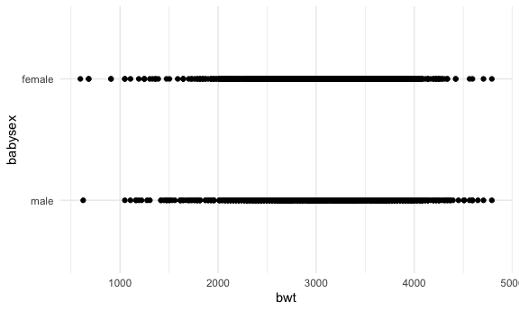

p8105\_hw6\_cm4070
================
claire mobley
12/1/2021

``` r
library(tidyverse)
```

    ## ── Attaching packages ─────────────────────────────────────── tidyverse 1.3.1 ──

    ## ✓ ggplot2 3.3.5     ✓ purrr   0.3.4
    ## ✓ tibble  3.1.4     ✓ dplyr   1.0.7
    ## ✓ tidyr   1.1.3     ✓ stringr 1.4.0
    ## ✓ readr   2.0.1     ✓ forcats 0.5.1

    ## ── Conflicts ────────────────────────────────────────── tidyverse_conflicts() ──
    ## x dplyr::filter() masks stats::filter()
    ## x dplyr::lag()    masks stats::lag()

``` r
set.seed(1)
library(rvest)
```

    ## 
    ## Attaching package: 'rvest'

    ## The following object is masked from 'package:readr':
    ## 
    ##     guess_encoding

``` r
knitr::opts_chunk$set(
  fig.width = 6,
  fig.asp = .6,
  out.width = "90%"
)
theme_set(theme_minimal() + theme(legend.position = "bottom"))
options(
  ggplot2.continuous.colour = "viridis",
  ggplot2.continuous.fill = "viridis"
)
scale_colour_discrete = scale_colour_viridis_d
scale_fill_discrete = scale_fill_viridis_d
```

## Load and Clean the `Birthweight` Dataset

This code will change the baby sex numeric variable into a factor with 2
levels, “male” and “female”

``` r
birthweight_data = read_csv("./birthweight.csv") %>% 
 mutate(babysex = factor(babysex, levels = c("1", "2"), labels = c("male", "female")),
        frace = factor(frace, levels = c("1", "2", "3", "4", "8", "9"), labels = c("white", "black", "asian", "puerto rican", "other", "unknown")), 
        malform = factor(malform, levels = c("0", "1"), labels = c("absent", "present")),
        mrace = factor(mrace, levels = c("1", "2", "3", "4", "8"), labels = c("white", "black", "asian", "puerto rican", "other"))) %>% 
drop_na() %>% 
select(babysex, bhead, blength, bwt, delwt, fincome, frace, gaweeks, malform, menarche, mheight, momage, mrace, parity, ppbmi, ppwt, smoken, wtgain)
```

    ## Rows: 4342 Columns: 20

    ## ── Column specification ────────────────────────────────────────────────────────
    ## Delimiter: ","
    ## dbl (20): babysex, bhead, blength, bwt, delwt, fincome, frace, gaweeks, malf...

    ## 
    ## ℹ Use `spec()` to retrieve the full column specification for this data.
    ## ℹ Specify the column types or set `show_col_types = FALSE` to quiet this message.

Let’s fit the model

``` r
birthweight_data %>% 
  ggplot(aes(x = bwt, y = babysex)) +
  geom_point()
```



``` r
fit = lm(bwt ~ babysex + bhead + blength + delwt + gaweeks + mheight + momage + mrace + ppbmi + ppwt + smoken + wtgain, data = birthweight_data)
```

Look at results..

``` r
broom::glance(fit)
```

    ## # A tibble: 1 × 12
    ##   r.squared adj.r.squared sigma statistic p.value    df  logLik    AIC    BIC
    ##       <dbl>         <dbl> <dbl>     <dbl>   <dbl> <dbl>   <dbl>  <dbl>  <dbl>
    ## 1     0.718         0.717  273.      846.       0    13 -30504. 61037. 61133.
    ## # … with 3 more variables: deviance <dbl>, df.residual <int>, nobs <int>

``` r
broom::tidy(fit) %>% 
select(-std.error, -statistic) %>% 
  mutate(
    term = str_replace(term, "mrace", "mother race:")
  )
```

    ## # A tibble: 15 × 3
    ##    term                     estimate    p.value
    ##    <chr>                       <dbl>      <dbl>
    ##  1 (Intercept)              -6322.    1.38e- 21
    ##  2 babysexfemale               29.2   5.66e-  4
    ##  3 bhead                      131.    5.60e-273
    ##  4 blength                     74.8   6.41e-261
    ##  5 delwt                        4.14  1.51e- 25
    ##  6 gaweeks                     11.3   1.04e- 14
    ##  7 mheight                     10.2   3.24e-  1
    ##  8 momage                       1.08  3.54e-  1
    ##  9 mother race:black         -143.    2.38e- 47
    ## 10 mother race:asian          -82.0   5.46e-  2
    ## 11 mother race:puerto rican  -105.    5.23e-  8
    ## 12 ppbmi                        5.01  7.37e-  1
    ## 13 ppwt                        -3.60  1.68e-  1
    ## 14 smoken                      -4.87  1.24e- 16
    ## 15 wtgain                      NA    NA

## Compare to other models

This model uses length at birth and gestational age as predictors:

``` r
fit1 = lm(bwt ~ blength + gaweeks, data = birthweight_data)
```

This model uses head circumference, length, sex, and all interactions
between these as predictors

``` r
fit2 = lm(bwt ~ bhead + blength + babysex + bhead * blength + bhead * babysex + blength * babysex + bhead * blength * babysex, data = birthweight_data)
```
