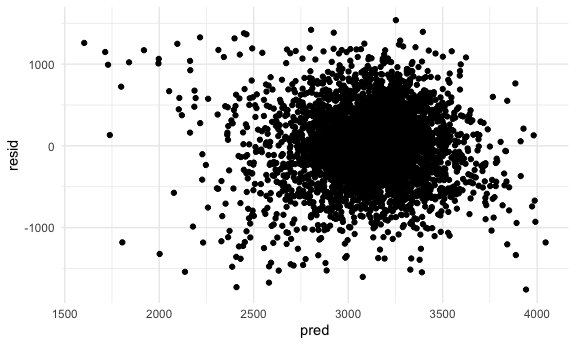
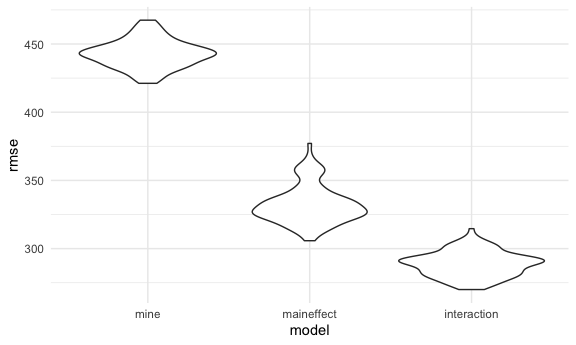
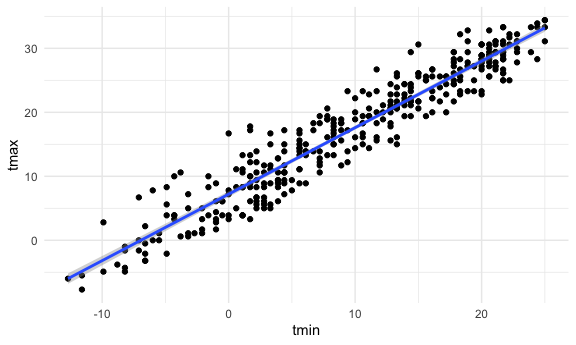
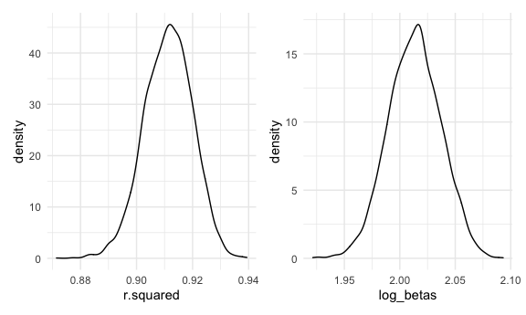

p8105\_hw6\_cm4070
================
Claire Mobley
12/1/2021

``` r
library(tidyverse)
set.seed(1)
library(rvest)
library(modelr)
library(mgcv)
library(patchwork)

knitr::opts_chunk$set(
  fig.width = 6,
  fig.asp = .6,
  out.width = "90%"
)
theme_set(theme_minimal() + theme(legend.position = "bottom"))
options(
  ggplot2.continuous.colour = "viridis",
  ggplot2.continuous.fill = "viridis"
)
scale_colour_discrete = scale_colour_viridis_d
scale_fill_discrete = scale_fill_viridis_d
```

## Problem 1

## Load and Clean the `Birthweight` Dataset

This code will change the babysex numeric variable into a factor with 2
levels, “male” and “female”, the frace numeric variable into factor
variable with levels, “white”, “black”, “asian”, “puerto rican”,
“other”, “unknown”, and the m race variable into factor variable with
levels “white”, “black”, “asian”, “puerto rican”, “other”, and look for
any missing values.

``` r
birthweight_data = read_csv("./birthweight.csv") %>% 
 mutate(babysex = factor(babysex, levels = c("1", "2"), labels = c("male", "female")),
        frace = factor(frace, levels = c("1", "2", "3", "4", "8", "9"), labels = c("white", "black", "asian", "puerto rican", "other", "unknown")), 
        malform = factor(malform, levels = c("0", "1"), labels = c("absent", "present")),
        mrace = factor(mrace, levels = c("1", "2", "3", "4", "8"), labels = c("white", "black", "asian", "puerto rican", "other"))) 
```

    ## Rows: 4342 Columns: 20

    ## ── Column specification ────────────────────────────────────────────────────────
    ## Delimiter: ","
    ## dbl (20): babysex, bhead, blength, bwt, delwt, fincome, frace, gaweeks, malf...

    ## 
    ## ℹ Use `spec()` to retrieve the full column specification for this data.
    ## ℹ Specify the column types or set `show_col_types = FALSE` to quiet this message.

``` r
sum(is.na(birthweight_data))
```

    ## [1] 0

## Propose a regression model

The code below will propose a model for birthweight. Based on scientific
literature regarding predictors of child birthweight, I propose the
following variables are contributors to overall birthweight and
important to be included in the model: babysex, mother’s weight at
delivery, gestational age in weeks, mother’s height and age, and smoking
status.

I was inspired to use these predictors based on these data sources:

smoking status & gestational age investigated in this paper & found to
be significant predictors:
<http://ijrar.com/upload_issue/ijrar_issue_20542354.pdf>

sex: <https://www.nature.com/articles/7211065>

mother’s height, age, and weight, I wanted to investigate the role of
anthropometric factors of the mother based on this datasource:
<https://pubmed.ncbi.nlm.nih.gov/17686192/>

``` r
fit = lm(bwt ~ babysex + delwt + gaweeks + mheight + momage + smoken, data = birthweight_data)

broom::tidy(fit)
```

    ## # A tibble: 7 × 5
    ##   term          estimate std.error statistic   p.value
    ##   <chr>            <dbl>     <dbl>     <dbl>     <dbl>
    ## 1 (Intercept)   -1146.     180.        -6.37 2.13e- 10
    ## 2 babysexfemale   -94.3     13.4       -7.02 2.58e- 12
    ## 3 delwt             4.72     0.333     14.2  1.36e- 44
    ## 4 gaweeks          61.5      2.15      28.6  1.28e-164
    ## 5 mheight          16.2      2.78       5.82 6.24e-  9
    ## 6 momage            9.69     1.75       5.52 3.55e-  8
    ## 7 smoken           -7.78     0.909     -8.55 1.61e- 17

``` r
broom::glance(fit)
```

    ## # A tibble: 1 × 12
    ##   r.squared adj.r.squared sigma statistic   p.value    df  logLik    AIC    BIC
    ##       <dbl>         <dbl> <dbl>     <dbl>     <dbl> <dbl>   <dbl>  <dbl>  <dbl>
    ## 1     0.258         0.257  442.      251. 3.71e-276     6 -32601. 65219. 65270.
    ## # … with 3 more variables: deviance <dbl>, df.residual <int>, nobs <int>

## Diagnostics

This code will provide a plot of model residuals against fitted values.

``` r
birthweight_data %>% 
  modelr::add_residuals(fit) %>% 
  modelr::add_predictions(fit) %>% 
  ggplot(aes(x = pred, y = resid)) +
  geom_point()
```



## Compare to other models

This model uses length at birth and gestational age as predictors

``` r
fit1 = lm(bwt ~ blength + gaweeks, data = birthweight_data)

broom::tidy(fit1)
```

    ## # A tibble: 3 × 5
    ##   term        estimate std.error statistic  p.value
    ##   <chr>          <dbl>     <dbl>     <dbl>    <dbl>
    ## 1 (Intercept)  -4348.      98.0      -44.4 0       
    ## 2 blength        129.       1.99      64.6 0       
    ## 3 gaweeks         27.0      1.72      15.7 2.36e-54

This model uses head circumference, length, sex, and all interactions
between these as predictors

``` r
fit2 = lm(bwt ~ bhead * blength * babysex, data = birthweight_data)

broom::tidy(fit2)
```

    ## # A tibble: 8 × 5
    ##   term                         estimate std.error statistic      p.value
    ##   <chr>                           <dbl>     <dbl>     <dbl>        <dbl>
    ## 1 (Intercept)                 -7177.     1265.       -5.67  0.0000000149
    ## 2 bhead                         182.       38.1       4.78  0.00000184  
    ## 3 blength                       102.       26.2       3.90  0.0000992   
    ## 4 babysexfemale                6375.     1678.        3.80  0.000147    
    ## 5 bhead:blength                  -0.554     0.780    -0.710 0.478       
    ## 6 bhead:babysexfemale          -198.       51.1      -3.88  0.000105    
    ## 7 blength:babysexfemale        -124.       35.1      -3.52  0.000429    
    ## 8 bhead:blength:babysexfemale     3.88      1.06      3.67  0.000245

## Cross validation

This code will make a comparison between the models in terms of the
cross-validated prediction error.

``` r
cv_df =
  crossv_mc(birthweight_data, 100) %>% 
  mutate(
    train = map(train, as_tibble),
    test = map(test, as_tibble))
```

``` r
cv_df = 
  cv_df %>% 
  mutate(
    mine_mod  = map(train, ~lm(bwt ~ babysex + delwt + gaweeks + mheight + momage + smoken, data = .x)),
     maineffect_mod = map(train, ~lm(bwt ~ blength + gaweeks, data = .x)),
    interaction_mod = map(train, ~lm(bwt ~ bhead * blength * babysex, data = as_tibble(.x)))) %>% 
  mutate(
    rmse_mine = map2_dbl(mine_mod, test, ~rmse(model = .x, data = .y)),
    rmse_maineffect = map2_dbl(maineffect_mod, test, ~rmse(model = .x, data = .y)),
    rmse_interaction = map2_dbl(interaction_mod, test, ~rmse(model = .x, data = .y)))
```

``` r
cv_df %>% 
  select(starts_with("rmse")) %>% 
  pivot_longer(
    everything(),
    names_to = "model", 
    values_to = "rmse",
    names_prefix = "rmse_") %>% 
  mutate(model = fct_inorder(model)) %>% 
  ggplot(aes(x = model, y = rmse)) + geom_violin()
```



## Problem 2

The code below loads the `weather` dataframe.

``` r
weather_df = 
  rnoaa::meteo_pull_monitors(
    c("USW00094728"),
    var = c("PRCP", "TMIN", "TMAX"), 
    date_min = "2017-01-01",
    date_max = "2017-12-31") %>%
  mutate(
    name = recode(id, USW00094728 = "CentralPark_NY"),
    tmin = tmin / 10,
    tmax = tmax / 10) %>%
  select(name, id, everything())
```

Plot of tmin and tmax for `weather` dataframe

``` r
weather_df %>% 
  ggplot(aes(x = tmin, y = tmax)) + 
  geom_point() + 
  geom_smooth(method = "lm")
```



## Bootstrapping

The code below will use 5000 bootstrap samples and, for each bootstrap
sample, produce estimates of R^2 and log(b0\*b1)

``` r
weather_bootstrap1 = 
  weather_df %>% 
  modelr::bootstrap(n = 5000, id = "strap_number") %>% 
  mutate(
    models = map(strap, ~ lm(tmax ~ tmin, data = .x)),
    results = map(models, broom::tidy)) %>% 
  select(strap_number, results) %>% 
  unnest(results) 

weather_bootstrap1
```

    ## # A tibble: 10,000 × 6
    ##    strap_number term        estimate std.error statistic   p.value
    ##    <chr>        <chr>          <dbl>     <dbl>     <dbl>     <dbl>
    ##  1 0001         (Intercept)     7.54    0.241       31.3 4.97e-105
    ##  2 0001         tmin            1.02    0.0180      56.4 8.83e-182
    ##  3 0002         (Intercept)     6.86    0.225       30.5 4.75e-102
    ##  4 0002         tmin            1.06    0.0172      61.9 5.33e-195
    ##  5 0003         (Intercept)     7.55    0.228       33.1 1.65e-111
    ##  6 0003         tmin            1.02    0.0176      57.7 5.64e-185
    ##  7 0004         (Intercept)     7.24    0.228       31.7 9.28e-107
    ##  8 0004         tmin            1.03    0.0177      58.4 1.23e-186
    ##  9 0005         (Intercept)     6.89    0.219       31.5 5.70e-106
    ## 10 0005         tmin            1.06    0.0164      64.7 2.07e-201
    ## # … with 9,990 more rows

``` r
weather_bootstrap2 = 
  weather_df %>% 
  modelr::bootstrap(n = 5000, id = "strap_number") %>% 
  mutate(
    models = map(strap, ~ lm(tmax ~ tmin, data = .x)),
    results = map(models, broom::glance)) %>% 
  select(strap_number, results) %>% 
  unnest(results)

weather_bootstrap2
```

    ## # A tibble: 5,000 × 13
    ##    strap_number r.squared adj.r.squared sigma statistic   p.value    df logLik
    ##    <chr>            <dbl>         <dbl> <dbl>     <dbl>     <dbl> <dbl>  <dbl>
    ##  1 0001             0.911         0.911  2.89     3722. 6.67e-193     1  -904.
    ##  2 0002             0.907         0.906  3.05     3522. 6.24e-189     1  -924.
    ##  3 0003             0.912         0.912  2.95     3771. 7.71e-194     1  -912.
    ##  4 0004             0.915         0.915  2.94     3906. 2.34e-196     1  -911.
    ##  5 0005             0.906         0.905  2.94     3479. 4.62e-188     1  -911.
    ##  6 0006             0.906         0.905  3.09     3482. 4.05e-188     1  -928.
    ##  7 0007             0.912         0.912  2.96     3777. 6.01e-194     1  -912.
    ##  8 0008             0.919         0.919  2.82     4118. 3.43e-200     1  -896.
    ##  9 0009             0.907         0.907  2.91     3542. 2.39e-189     1  -907.
    ## 10 0010             0.913         0.913  2.91     3822. 8.29e-195     1  -906.
    ## # … with 4,990 more rows, and 5 more variables: AIC <dbl>, BIC <dbl>,
    ## #   deviance <dbl>, df.residual <int>, nobs <int>

## Plot of r.squared estimate

``` r
bootstrapplot_r = 
weather_bootstrap2 %>% 
ggplot(aes(x = r.squared)) + geom_density()
```

## Plot of log(B^0\*B^1)

``` r
weather_bootstrap1_log = 
weather_bootstrap1 %>% 
  select(strap_number, term, estimate) %>%
  pivot_wider(names_from = "term",
            values_from = "estimate") %>%
  rename(b0 = `(Intercept)`) %>% 
  rename(b1 = tmin) %>% 
  mutate(log_betas = log(b0*b1)) 
```

## Plot of log(b0\*b1)

``` r
bootstrapplot_log = 
  weather_bootstrap1_log %>% 
  ggplot(aes(x = log_betas)) + geom_density()
```

## Plot of both estimates

``` r
bootstrapplot_r + bootstrapplot_log
```



## Construct 95% CI for R^2 and log(b0\*b2)

``` r
weather_bootstrap2 %>% 
  summarize(
    ci_lower = quantile(r.squared, 0.0275),
    ci_upper = quantile(r.squared, 0.975))
```

    ## # A tibble: 1 × 2
    ##   ci_lower ci_upper
    ##      <dbl>    <dbl>
    ## 1    0.894    0.927

The 95% confidence interval for r^2 is between .894 and 0.927.

``` r
weather_bootstrap1_log %>% 
  summarize(
    ci_lower = quantile(log_betas, 0.0275),
    ci_upper = quantile(log_betas, 0.975))
```

    ## # A tibble: 1 × 2
    ##   ci_lower ci_upper
    ##      <dbl>    <dbl>
    ## 1     1.97     2.06

The 95% confidence interval for log(b0\*b1) is between 1.97 and 2.06.
